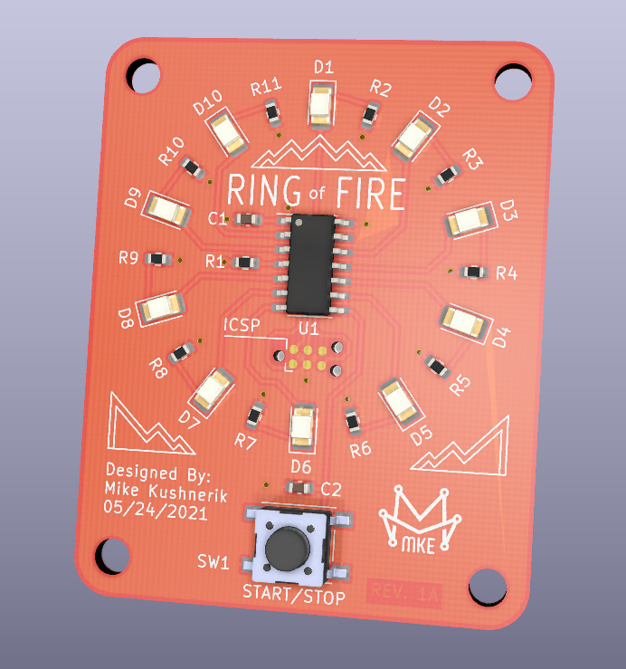
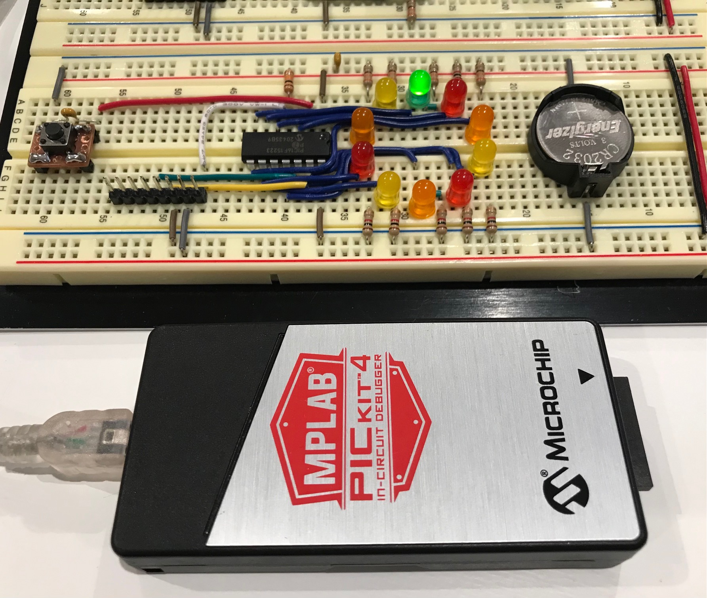
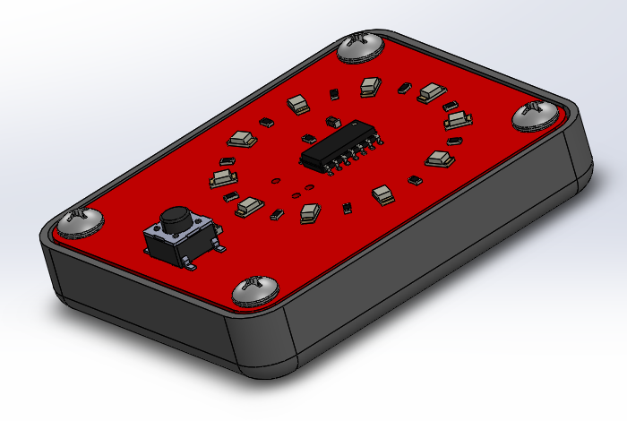

# PIC16_Ring_of_Fire_Game
A PIC16 based LED Reaction Time Game

This is a simple LED reaction time game based on the classes light ring redemption games seen in arcades. 

# Project Description

The device uses a PIC16F15223 8-bit microcontroller to drive a ring of 1206 LEDs. A low cost tactile switch starts and stops the led chaser and allows for switching between game mode and a speed settings mode depending on the press duration. Programming the device is completed via the onboard Tag-Connect footprint.

# Breadboard Prototype

# Enclosure

To make the device more comfortable for handheld use, I designed a small enclosure which can be easily 3D printed for a more professional device appearence.

Designed by Mike Kushnerik (MKE) in KiCad V5

# License

MKE supports the open source hardware community by sharing hardware design files freely on GitHub!

Please support MKE by purchasing products on [Tindie](https://www.tindie.com/stores/mkengineering/)!

Designed by Mike Kushnerik for MKEngineering

Licensed under [Creative Commons Attribution-ShareAlike CC BY-SA 3.0](http://creativecommons.org/licenses/by-sa/3.0/)

All text above must be included in any redistribution!
